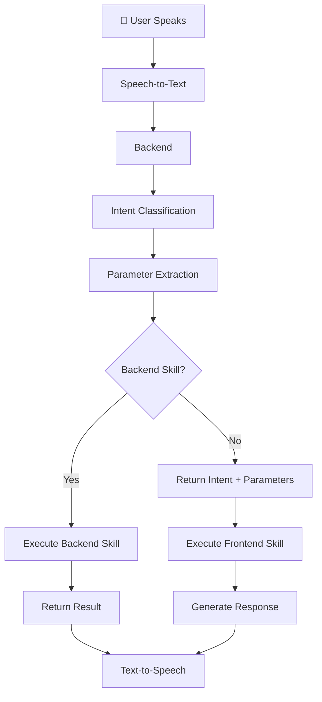

# JARVIS - A Modular AI Assistant

<p align="center">

**A hands-free AI assistant built for natural human-computer interaction.**

Voice. Vision. Intelligence.

Designed to be modular, extensible, and client-agnostic.

</p>

---

## 🎥 Demo

Watch JARVIS in action:

[](https://youtu.be/HpdUKONb0ZY)

---

# ✨ Why JARVIS?

JARVIS is a modular AI assistant designed around the idea that interacting with computers should feel natural.

Instead of relying on a keyboard and mouse, users interact with JARVIS using **voice commands** and **hand gestures**. The project follows a client-server architecture where multiple frontends can communicate with a common AI backend.

Although this repository demonstrates JARVIS using a **Pygame desktop client**, the backend is designed to support multiple interfaces including:

* 🖥️ Desktop
* 🌐 Web
* 📱 Mobile
* 🤖 Discord Bots
* ...and future clients

Beyond being an AI assistant, JARVIS serves as a learning platform for club members to explore modern AI systems, software architecture, computer vision, natural language processing, and LLM-powered applications.

---

# 🚀 Features

### 🎙️ Hands-Free Interaction

* Voice-controlled interface
* Hand gesture support
* No keyboard or mouse required for normal operation

### 🧠 Intelligent Request Routing

JARVIS understands user requests using:

* Intent Classification
* Parameter Extraction

Once a request is understood, it is automatically routed to the appropriate client-side or server-side skill.

---

### ⚙️ Current Backend Skills

* 🌤️ Weather
* 😂 Jokes
* 📚 Club Knowledge Q&A (RAG-based)
* 🌐 General Question Answering using Web Search
* ➗ Quick Math

---

### 💻 Current Frontend Skills

* 🎵 Music Playback
* 🌐 Browser Automation *(Work in Progress)*

---

# 🏗️ Architecture

```text
                   +-------------------+
                   |     Frontend      |
                   | (Desktop/Web/etc) |
                   +---------+---------+
                             |
                 Speech-to-Text
                             |
                             v
                   +-------------------+
                   |     Backend        |
                   |                   |
                   | Intent Classifier |
                   | Parameter Extract |
                   +---------+---------+
                             |
          +------------------+------------------+
          |                                     |
 Backend Skill                        Frontend Skill
          |                                     |
          +------------------+------------------+
                             |
                       Response Text
                             |
                      Text-to-Speech
                             |
                           User
```

The backend is intentionally independent of the frontend, allowing multiple clients to reuse the same AI pipeline.

---

# 🔄 Request Flow



---

# 📁 Repository Structure

```text
JARVIS
│
├── backend/
│   ├── FastAPI backend
│   ├── Intent Classification
│   ├── Parameter Extraction
│   └── Backend Skills
│
├── pygame_frontend/
│   ├── Desktop Client
│   ├── Voice Interface
│   ├── Hand Gesture Interface
│   └── Frontend Skills
│
├── AI_Browser_Agent/
│   Experimental browser automation
│
├── discord_bot/
│   Experimental Discord client
│
├── requirements.txt
├── LICENSE
└── README.md
```

---

# 🛠️ Tech Stack

## Core

* Python
* FastAPI
* Pygame

## AI

* Ollama
* PyTorch
* Transformers
* Sentence Transformers
* spaCy

## Computer Vision

* MediaPipe

## Speech

* Google Speech Recognition
* Edge TTS

## Future

* ChromaDB for vector storage

---

# 🚀 Getting Started

## 1. Clone the repository

```bash
git clone <repo-url>
cd JARVIS
```

---

## 2. Create a virtual environment

```bash
python -m venv .venv
```

Activate it.

---

## 3. Install dependencies

```bash
pip install -r requirements.txt
```

---

## 4. Install the spaCy model

```bash
python -m spacy download en_core_web_sm
```

---

## 5. Install Ollama

Install Ollama and pull a lightweight model of your choice.

---

## 6. Start the backend

```bash
cd backend

uvicorn server:app --reload
```

---

## 7. Start the frontend

```bash
cd pygame_frontend

python ui.py
```

---

## Requirements

* 🎤 Microphone
* 📷 Webcam
* Python 3.x

---

# ➕ Adding New Skills

JARVIS is designed around intent recognition and parameter extraction, making it straightforward to extend with new capabilities.

Currently, skills are routed through explicit logic in the codebase.

A registration/plugin-based architecture is planned, allowing future skills to be added in a true plug-and-play fashion with minimal configuration.

---

# 🧪 Experimental Features

The repository also contains experimental components under active development.

* AI Browser Agent
* Discord Bot Client

These projects are still evolving and may change significantly.

---

# 🗺️ Roadmap

* Plugin-based skill registration
* Browser automation
* Mobile client
* Web client
* Discord integration
* ChromaDB integration for Retrieval-Augmented Generation
* Improved multimodal interactions
* Additional AI-powered skills

---

# 🤝 Contributing

Contributions are always welcome.

Whether you're interested in AI, computer vision, backend development, frontend applications, or software architecture, there are plenty of opportunities to contribute.

Feel free to open issues, submit pull requests, or propose new skills and improvements.

---

# 📄 License

This project is licensed under the MIT License.

See the `LICENSE` file for details.

---

<p align="center">

**Built with ❤️ by the AI and Robotics Club, NIT Andhra Pradesh.**

*"The best way to learn AI is to build AI."*

</p>
